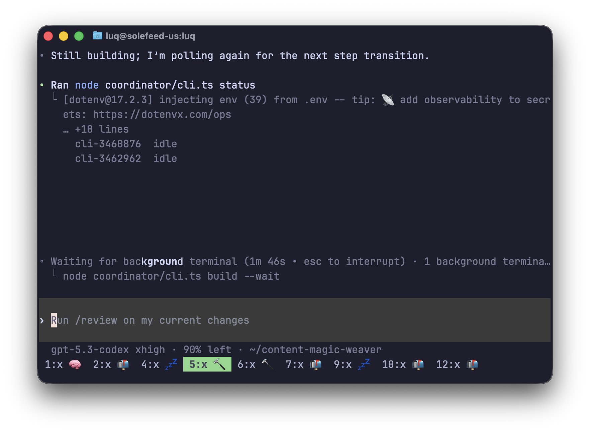

I run a ton of codex and claude code tabs at the same time in tmux. I got tired of switching tabs constantly to check on progress. Now I have emojis let me when an agent needs attention.

```
| 1:x 🧠 | 2:c 🔨 | 3:x 💤 | 4:x 📬 | 5:zsh |
c = claude code , x = codex
```

<p align="center">
  
</p>
<p align="center">
  <em>Live pane activity + unread attention markers, directly in tmux window names.</em>
</p>

## Statuses

| Emoji | Meaning |
|-------|---------|
| 🧠 | Agent is actively thinking/working |
| 💤 | Agent is idle / waiting (already seen) |
| 📬 | Unread: agent finished or needs your attention while unfocused |
| 🔨 | Build/compile task |
| 🧪 | Test task |
| 📦 | Package install task |
| 🔀 | Git task |
| 🌐 | Network task |
| ⚙️ | Other subprocess task |

Prefixes:
- `x ` for Codex tabs (example: `x 🧠`)
- `c ` for Claude tabs (example: `c 🧠`)

When no agent is detected, tmux automatic rename is restored (for example `zsh`).

## Detection model

Every 2 seconds the daemon:

1. Lists tmux panes and shell PIDs.
2. Walks `/proc` to find Claude/Codex under each pane shell.
3. Uses **live descendant processes first** to classify status.
4. Falls back to pane text only when no live worker child is active.
5. Applies unread logic and updates the tmux window name.

### Why process-first

This avoids the two failure modes we hit in practice:
- Running in background but prompt visible: should still be active (`🧠`/`🔨`), not `💤`.
- Old spinner text left in scrollback: should not keep tab stuck in `🧠` forever.

### Unread (`📬`) rules

A tab is marked unread only on meaningful unfocused transitions:
- working → idle (completion), or
- prompt/completion signature changes after initial baseline.

Focusing the window clears unread.

## Anti-flicker behavior

- Active grace period: `10s` (`activeGrace`) to survive spinner redraw gaps.
- Stale active marker decay: if the same active marker repeats with a visible prompt for `12s`, it is treated as stale and no longer forces `🧠`.
- Status stability threshold: currently `1` cycle (fast updates).

## Requirements

- Linux (`/proc` access)
- tmux
- Go 1.22+ (build only)


## Install

```bash
git clone https://github.com/donkeysrus/tmux-ai-status.git
cd tmux-ai-status
make install
```

This builds `tmux-ai-status` and copies it to `~/.local/bin/tmux-ai-status`.

## Running options

### Option A: tmux hook (simple)

Add to `~/.tmux.conf`:

```tmux
set-hook -g session-created 'run-shell -b "pgrep -f tmux-ai-status >/dev/null || ~/.local/bin/tmux-ai-status &"'
```

Reload tmux config:

```bash
tmux source-file ~/.tmux.conf
```

### Option B: systemd user service (recommended)

Create `~/.config/systemd/user/tmux-ai-status.service`:

```ini
[Unit]
Description=tmux AI status daemon
After=default.target

[Service]
Type=simple
ExecStart=%h/.local/bin/tmux-ai-status
Restart=always
RestartSec=2

[Install]
WantedBy=default.target
```

If your local binary name is different (for example `tmux-ai-status-bin`), update `ExecStart` accordingly.

Enable + start:

```bash
systemctl --user daemon-reload
systemctl --user enable --now tmux-ai-status.service
```

Check status/logs:

```bash
systemctl --user status tmux-ai-status.service
journalctl --user -u tmux-ai-status.service -n 100 --no-pager
```

## Supported agents

- [Claude Code](https://docs.anthropic.com/en/docs/claude-code)
- [Codex CLI](https://github.com/openai/codex)

## Tests

```bash
make test
```

The suite includes regressions for:
- stale spinner vs prompt interactions,
- process-first classification,
- unread transition rules.

## Monorepo Publishing

If this project lives inside a larger monorepo, publish only `tmux-ai-status/` using subtree split:

```bash
# from monorepo root
bash scripts/publish-tmux-ai-status.sh
```

The helper script:
- runs a heuristic secret scan on `tmux-ai-status/`,
- creates `OWNER/tmux-ai-status` on GitHub if missing,
- splits history with `git subtree split --prefix=tmux-ai-status`,
- pushes to `main` on the public repo.

## Uninstall

```bash
pkill -f tmux-ai-status
rm ~/.local/bin/tmux-ai-status
systemctl --user disable --now tmux-ai-status.service 2>/dev/null || true
rm -f ~/.config/systemd/user/tmux-ai-status.service
systemctl --user daemon-reload
```

## License

MIT
